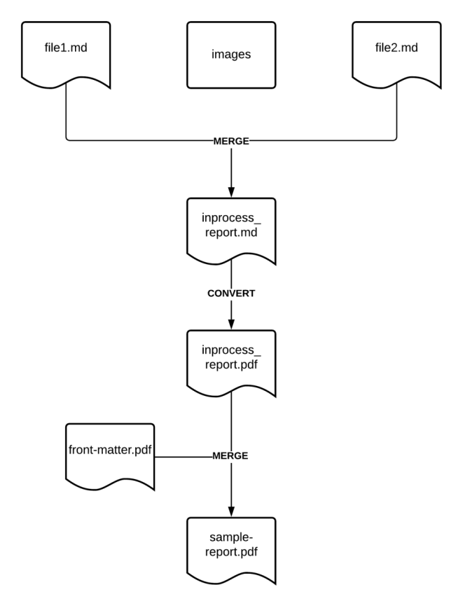
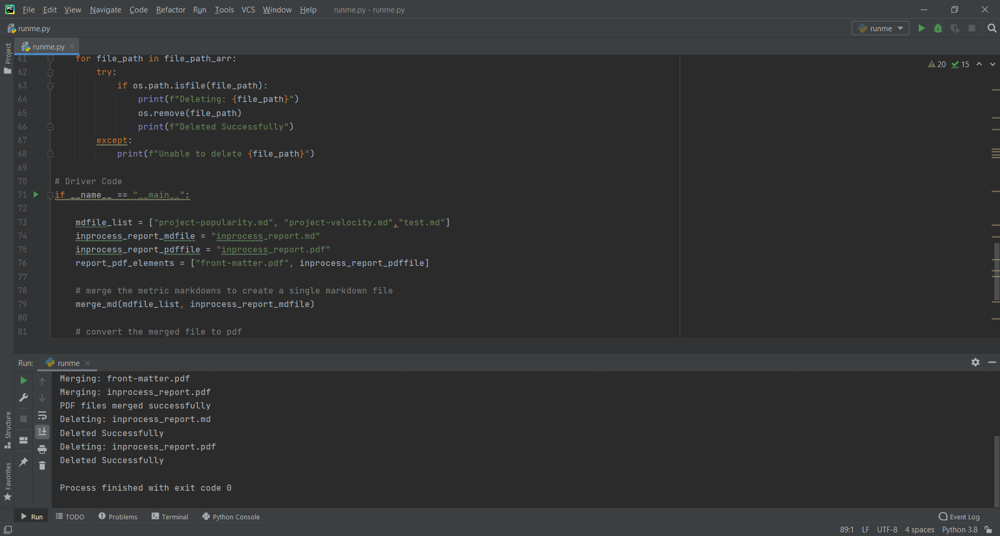

# Microtask -3
 
 This README describes the process for the generation of sample report. 

## Pre-Requisites

The following libraries and the packages were used in the process of report generation.

- [Pandoc](https://pandoc.org/installing.html)
- [PyPandoc](https://pypi.org/project/pypandoc/)
- [PyPDF2](https://pypi.org/project/PyPDF2/)
- LaTeX Distribution

## Files

- The markdown files used to test the process of report generation are taken from [wg-value](https://github.com/chaoss/wg-value). No changes have been made to the metric markdown files.
    - [Project Popularity](https://github.com/chaoss/wg-value/blob/master/focus-areas/communal-value/project-popularity.md)
    - [Project Velocity](https://github.com/chaoss/wg-value/blob/master/focus-areas/communal-value/project-velocity.md)
- A folder ['images'](images) was created to store the images required for the proper display of these files.
- A PDF file [front-matter.pdf](front-matter.pdf) has been used to incorporate the cover page and list of contributors. The file was exported as PDF from [here](https://drive.google.com/file/d/1xoWpNPO95n2V1l4rWS7pIHfoQiAUPtcl/view?usp=sharing).
- Additionally, another markdown file [test.md](test.md) was created to showcase the styling of code and tables.
- The [header.tex](header.tex) file is used for formatting the PDF during the conversion process.
- The [runme.py](runme.py) script is used to thread together the processes required for report generation.

## Report Generation Process

The process of report generation is easy to understand. It has been described below.

### Merger of Markdown Files

- Firstly, the two chosen markdown files are merged to create a single markdown file.
- The merging is simply done by using Python to create a third markdown file and writing the contents of the chosen two files to it.

### Conversion to PDF

- The generated markdown file is converted to PDF using PyPandoc.

- Different formatting flags and files have been used to style the PDF during the conversion process.
    
### Incorporation of Front-Content

- The PyPDF2 library has been used to merge the generated PDF with the front elements of the report.
- The merged PDF formed is the required report.

### Removal of Intermediate Files

- The process of report generation creates some intermediate files.
- These files can be deleted after the final report has been generated.
- The [os](https://docs.python.org/3/library/os.html) library has been used to remove these files.

## Execution
- To execute the process described above, we simple need to run the Python script [runme.py](runme.py).

- On successful execution, the output will be similar to the following picture.

    

## References

- https://handbook.chaoss.community/community-handbook/community-initiatives/metrics/chaoss-metric-release

- https://learnbyexample.github.io/customizing-pandoc/

